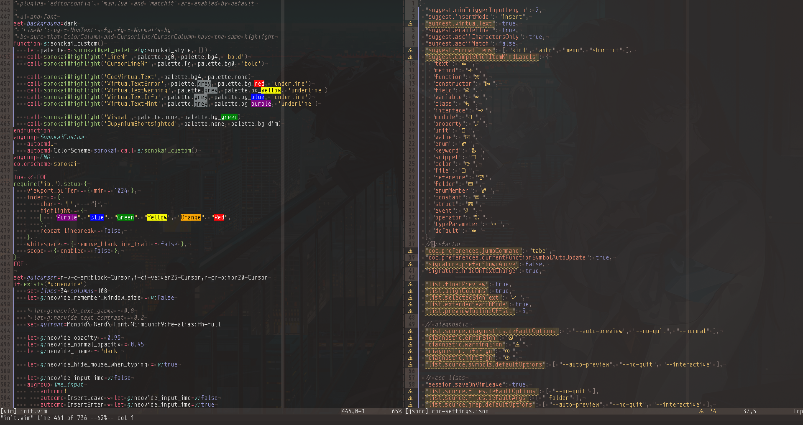
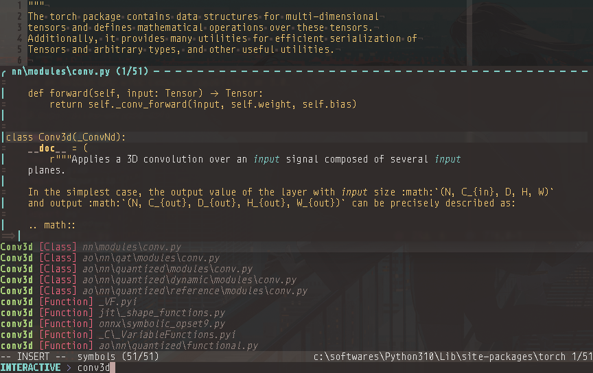
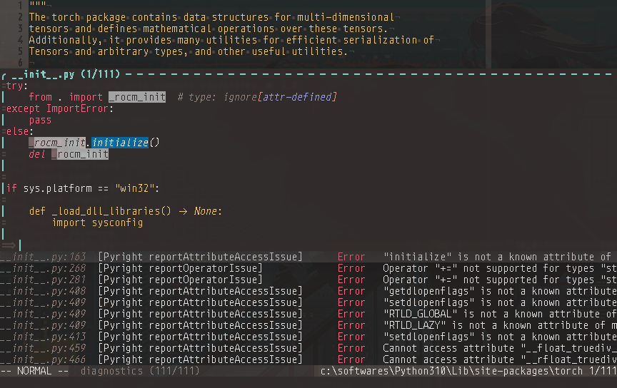
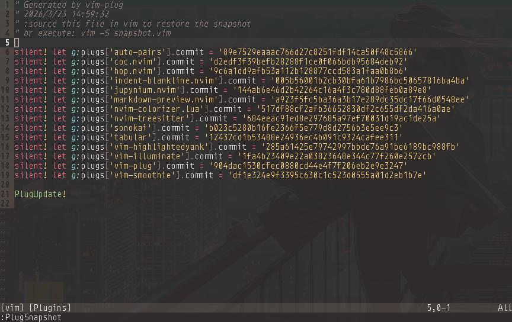
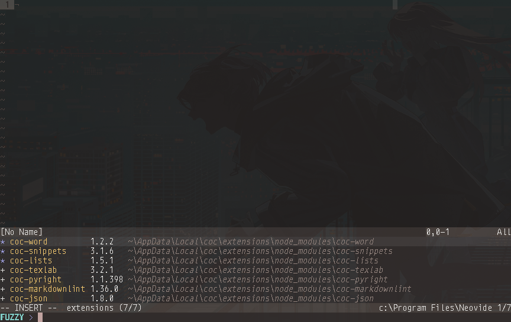

My personal Neovim configuration for editing `python`, `c/cpp`, `markdown` and `LaTeX` files in Windows, naive but not simple  

# Screenshots

`vimrc` and `coc-settings`


search workspace symbols of pytorch (after finishing index)


list all diagnostics info and locations of the current buffer, and move the cursor to the float window


# Requirements

1. `Neovim` >= v0.9.1  
    - `Python` 3.4+, packages `pynvim` and `neovim-remote`  

$$
{\Large\color{tomato}\mathrm{Important!!!}}
$$

If you're using Conda virtual environment, don't forget to specify these two variables in `init.vim`:  
* `g:python3_host_prog`  
* `g:conda_env`  

2. GUI/client: `Nvy` [Nvy](https://github.com/RMichelsen/Nvy/releases)  

> Builtin `neovim-qt/nvim-qt` doesn't support `Direct Write`  

3. `guifont`: 等距更纱黑体 Slab SC [Sarasa-Gothic](https://github.com/be5invis/Sarasa-Gothic/releases)

<details>
<summary>sarasa-mono-sc & sarasa-mono-slab-sc</summary>

- sarasa-mono-sc-bold.ttf  
- sarasa-mono-sc-bolditalic.ttf  
- sarasa-mono-sc-extralight.ttf  
- sarasa-mono-sc-extralightitalic.ttf  
- sarasa-mono-sc-italic.ttf  
- sarasa-mono-sc-light.ttf  
- sarasa-mono-sc-lightitalic.ttf  
- sarasa-mono-sc-regular.ttf  
- sarasa-mono-sc-semibold.ttf  
- sarasa-mono-sc-semibolditalic.ttf  
- sarasa-mono-slab-sc-bold.ttf  
- sarasa-mono-slab-sc-bolditalic.ttf  
- sarasa-mono-slab-sc-extralight.ttf  
- sarasa-mono-slab-sc-extralightitalic.ttf  
- sarasa-mono-slab-sc-italic.ttf  
- sarasa-mono-slab-sc-light.ttf  
- sarasa-mono-slab-sc-lightitalic.ttf  
- sarasa-mono-slab-sc-regular.ttf  
- sarasa-mono-slab-sc-semibold.ttf  
- sarasa-mono-slab-sc-semibolditalic.ttf  
</details>

4. `junegunn/vim-plug`: put `plug.vim` in `stdpath('data') . '/site/autoload'`  
    - default plug path: `stdpath('data') . '/plugged'`  

> To set proxy for git:  
```
git config --global http.proxy http://127.0.0.1:1080
git config --global https.proxy https://127.0.0.1:1080
```

$$
{\Large\color{tomato}\mathrm{Supported\ plugins}}
$$

In `init.vim`:  

`/^Plug` for vim plugins


`/g:coc_global_extensions` for coc extensions


## `nvim-treesitter/nvim-treesitter`

- `Visual Studio Build Tools` [Windows-support](https://github.com/nvim-treesitter/nvim-treesitter/wiki/Windows-support#msvc)

After installing this plugin, run Neovim via Visual Studio's "x64 Native Tools Command Prompt" console, then run `:TSInstall all` to compile all parsers  

## `neoclide/coc.nvim`

- `Node.js` >= 14.14  

### `coc-pyright`

- python packages: `ruff`, `yapf`  

### `coc-texlab`

- `Tex Live` (or other TeX distribution)  
- `SumatraPDF`  
    - Add `SumatraPDF.exe` to PATH Environment Variable  
- Install [Microsoft Visual C++ Redistributable for Visual Studio 2015](https://aka.ms/vs/16/release/vc_redist.x64.exe)  

> For the content of `$HOME/.latexmkrc` and the instruction to configure inverse search of SumatraPDF, see the comments in `coc-settings.json`  

## `iamcco/markdown-preview.nvim`

- Add `chrome.exe` to PATH Environment Variable  
- Install `yarn`:  
``` ps1
Set-ExecutionPolicy -ExecutionPolicy RemoteSigned
npm install -g yarn
```

**Note:** this syntax will cause bug:  
``` markdown
2 trailing spaces  
          ||  
A sentence  

```

# TODO

See the beginning of `init.vim`  

# Bonus

See `coc-lists-ripgrep.md`, `ccls.md`, `jupynium.nvim.md` and `VimTweak.md`  
