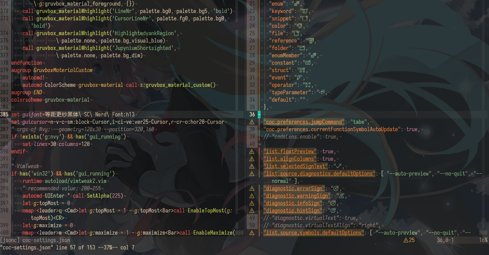
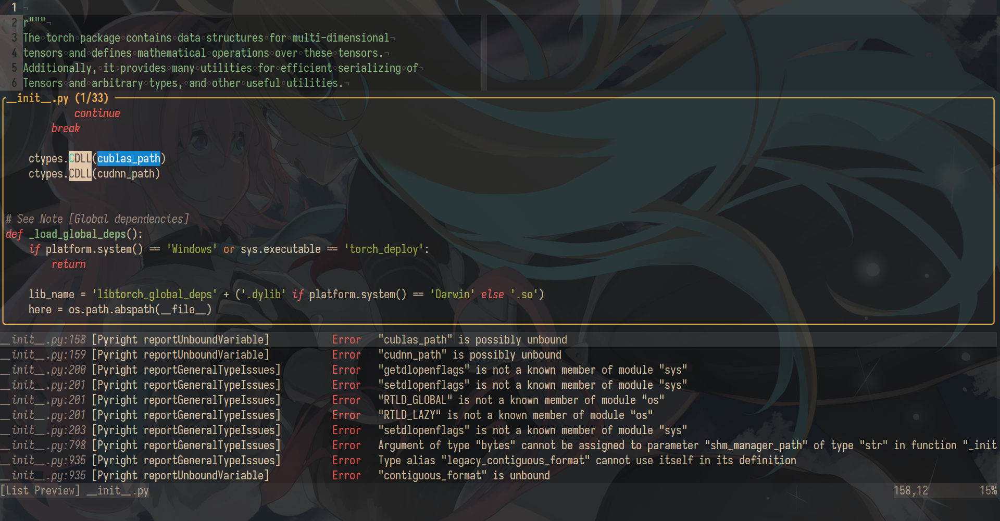
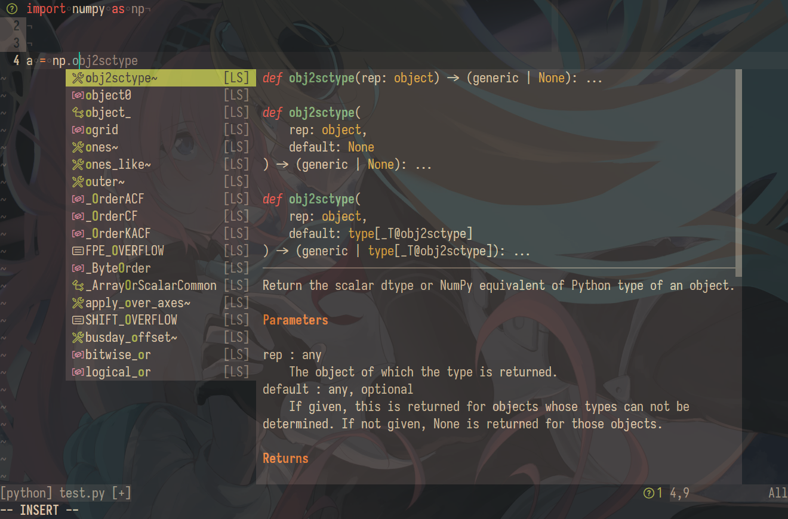
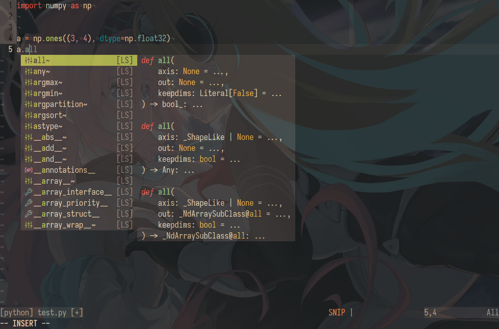
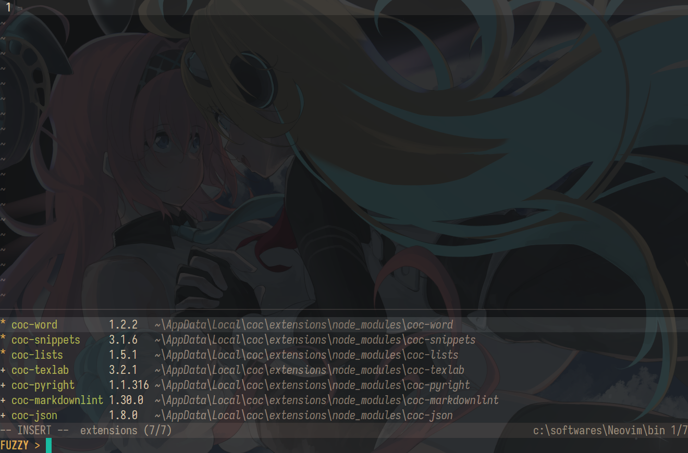

My personal Neovim configuration for editing `python`, `c/cpp`, `markdown` and `LaTeX` files in Windows, naive but not simple  

# Screenshots

`vimrc` and `coc-settings`


search workspace symbols of pytorch (after finishing index)


list all diagnostics info and locations of the current buffer, and move the cursor to the float window


icons in completion items of `coc.nvim`



# Requirements

1. `Neovim` >= v0.9.1  
    - `Python` 3.4+, packages `pynvim` and `neovim-remote`  

$$
{\Large\color{tomato}\mathrm{Important!!!}}
$$

If you're using Conda virtual environment, don't forget to specify these two variables in `init.vim`:  
* `g:python3_host_prog`  
* `g:conda_env`  

2. GUI/client: `Nvy` [Nvy](https://github.com/RMichelsen/Nvy/releases)  

> Builtin `neovim-qt/nvim-qt` doesn't support `Direct Write`  

3. `guifont`: 等距更纱黑体 Slab SC Nerd Font [sarasa-mono-slab-sc-nerd-font](https://github.com/jonz94/Sarasa-Gothic-Nerd-Fonts/releases)  

4. `junegunn/vim-plug`: put `plug.vim` in `stdpath('data') . '/site/autoload'`  
    - default plug path: `stdpath('data') . '/plugged'`  

> To set proxy for git:  
```
git config --global http.proxy http://127.0.0.1:1080
git config --global https.proxy https://127.0.0.1:1080
```

$$
{\Large\color{tomato}\mathrm{Supported\ plugins}}
$$

In `init.vim`:  

`/^Plug` for vim plugins


`/g:coc_global_extensions` for coc extensions


## `nvim-treesitter/nvim-treesitter`

- `Visual Studio Build Tools` [Windows-support](https://github.com/nvim-treesitter/nvim-treesitter/wiki/Windows-support#msvc)

After installing this plugin, run Neovim via Visual Studio's "x64 Native Tools Command Prompt" console, then run `:TSInstall all` to compile all parsers  

## `neoclide/coc.nvim`

- `Node.js` >= 14.14  

### `coc-pyright`

- python packages: `ruff`, `yapf`  

### `coc-texlab`

- `Tex Live` (or other TeX distribution)  
- `SumatraPDF`  
    - Add `SumatraPDF.exe` to PATH Environment Variable  
- Install [Microsoft Visual C++ Redistributable for Visual Studio 2015](https://aka.ms/vs/16/release/vc_redist.x64.exe)  

> For the content of `$HOME/.latexmkrc` and the instruction to configure inverse search of SumatraPDF, see the comments in `coc-settings.json`  

## `iamcco/markdown-preview.nvim`

- Add `chrome.exe` to PATH Environment Variable  
- Install `yarn`:  
``` ps1
Set-ExecutionPolicy -ExecutionPolicy RemoteSigned
npm install -g yarn
```

**Note:** this syntax will cause bug:  
``` markdown
2 trailing spaces  
          ||  
A sentence  

```

# TODO

See the beginning of `init.vim`  

# Bonus

See `coc-lists-ripgrep.md`, `ccls.md`, `jupynium.nvim.md` and `VimTweak.md`  
