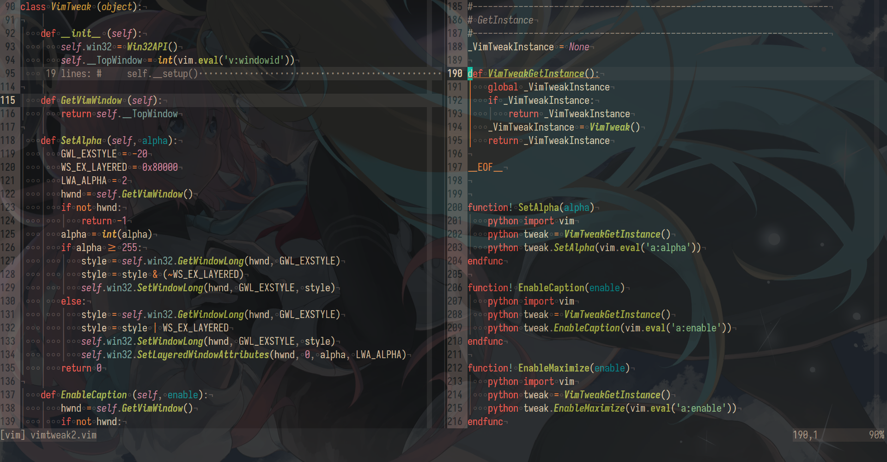

# `VimTweak`

Make the Neovim window translucent, maximize, keep on top (Windows system only)  

## Screenshots



## Build `Nvy`

``` dosbatch
git clone https://github.com/RMichelsen/Nvy.git
```

In the file `https://github.com/RMichelsen/Nvy/blob/master/src/nvim/nvim.cpp`  
At the first line, add:  
``` cpp
#include <string>
```

Below the code block `// Set g:nvy global variable`:  
``` cpp
	// Set v:windowid
	std::string command = "let v:windowid=";
	command += std::to_string(HandleToLong(hwnd));
	NvimSendCommand(nvim, command.c_str());
```

Then build `Nvy`:  
> run these commands via Visual Studio's "x64 Native Tools Command Prompt" console  
``` dosbatch
cd Nvy
mkdir build
cd build
cmake .. -GNinja -DCMAKE_EXPORT_COMPILE_COMMANDS=YES -DCMAKE_BUILD_TYPE=Release
move .\compile_commands.json ..\
ninja
```

> TODO: garbled characters in LICENSE  

## `vimtweak2.vim`

Put the file in `stdpath('config') . '\autoload'`

Ref: [skywind3000/vimtweak2.vim](https://gist.github.com/skywind3000/8eb41acd9d5175715694c765f92fa667/f95633bbab684f2438442535561dfb642ac7e659)

## In `init.vim`

``` vim
" VimTweak
if has('win32') && has('gui_running')
    runtime autoload/vimtweak2.vim
    " recommended value: 200~255
    autocmd UIEnter * call SetAlpha(221)
    let g:topMost = 0
    nmap <leader>q <Cmd>let g:topMost = 1 - g:topMost<Bar>call EnableTopMost(g:topMost)<CR>
    let g:maximize = 0
    nmap <leader>m <Cmd>let g:maximize = 1 - g:maximize<Bar>call EnableMaximize(g:maximize)<CR>
endif
```

## TODO

**This plugin incurs about 100ms of startup time overhead...**  
