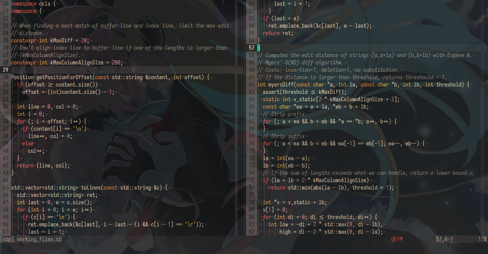
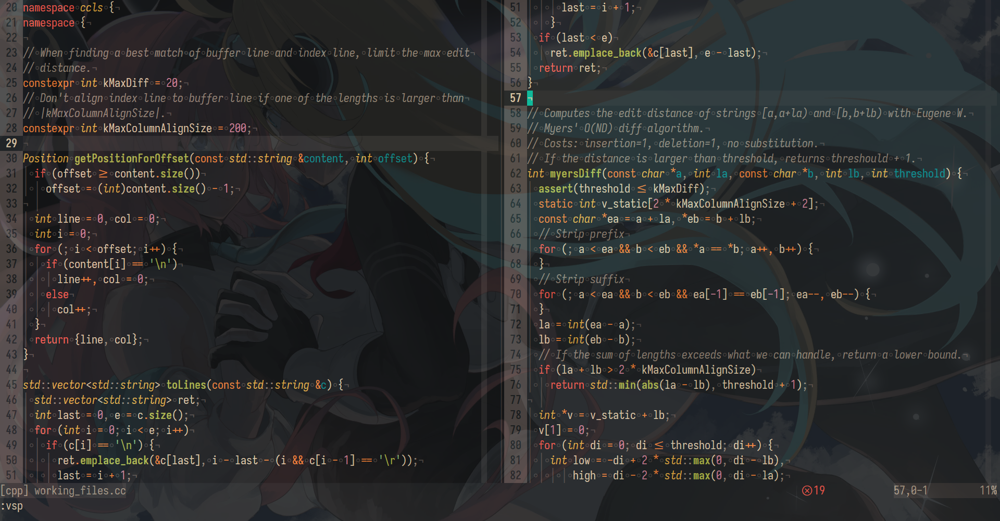
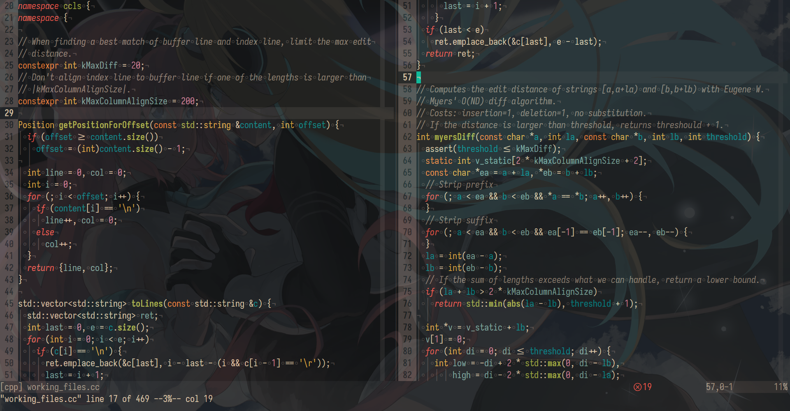
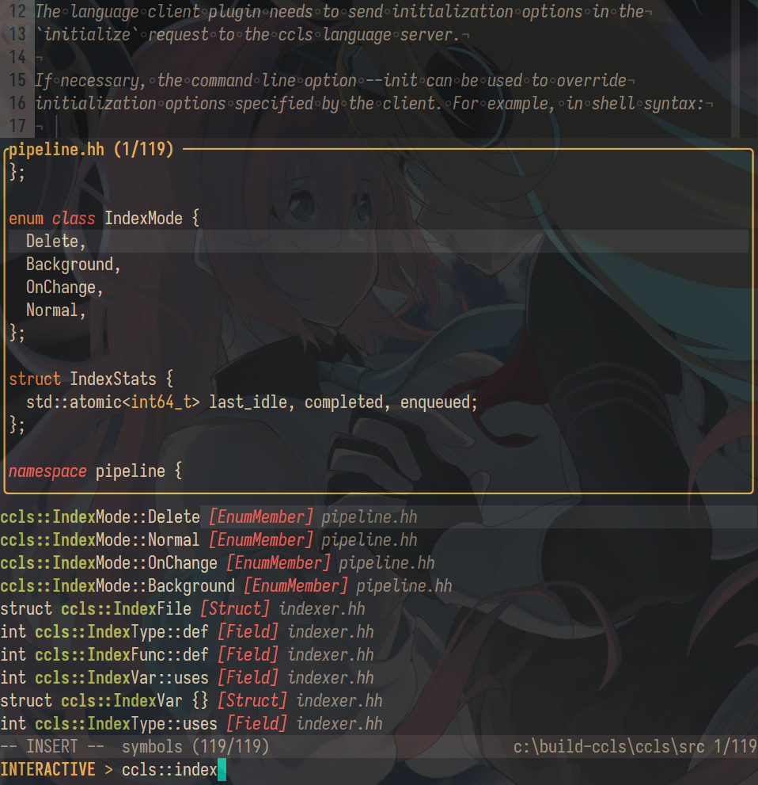

# `MaskRay/ccls`

## Screenshots

Highlight by vim naive syntax


Highlight by `treesitter`


Highlight by `ccls`


Search workspace symbols


Hover


## Build ccls

Requirements:  

- CMake >= 3.8  
- A C++ compiler with C++17 support, e.g., MSVC >= 2017  
    - Microsoft Visual Studio Community 2019 ver. 16.11.26  
- Ninja  
- Clang+LLVM headers and libraries, version >= 7  

### 1. Build Clang+LLVM by yourself

Execute these commands via "Developer Command Prompt for VS" console  

``` dosbatch
git clone -b release/14.x --depth 1 https://github.com/llvm/llvm-project.git
cd llvm-project
cmake -Hllvm -BRelease -G Ninja -DCMAKE_BUILD_TYPE=Release -DCMAKE_C_COMPILER=cl -DCMAKE_CXX_COMPILER=cl -DLLVM_TARGETS_TO_BUILD=X86 -DLLVM_ENABLE_PROJECTS=clang
ninja -C Release clangFormat clangFrontendTool clangIndex clangTooling clang
```

### 2. Then build ccls

Do not forget to change `-DCMAKE_PREFIX_PATH`  
> The clang resource directory is hard-coded into ccls at compile time  

``` sh
git clone --depth=1 --recursive https://github.com/MaskRay/ccls
cd ccls
cmake -H. -BRelease -G Ninja -DCMAKE_BUILD_TYPE=Release -DCMAKE_CXX_COMPILER=clang-cl -DCMAKE_C_COMPILER=clang-cl -DCMAKE_PREFIX_PATH="C:\build-ccls\llvm-project\Release"
ninja -C Release
```

Finally, add `*\ccls\Release` to the PATH Environment Variable  

## In `coc-settings.json`

``` jsonc
{
  // ccls
  "languageserver": {
    "ccls": {
      "command": "ccls",
      "filetypes": [ "c", "cpp", "cuda", "objc", "objcpp" ],
      "rootPatterns": [ ".ccls", "compile_commands.json" ],
      "initializationOptions": {
        "cache": {
          "directory": ".ccls-cache",
          "format": "binary"
        },
        "index": { "multiVersion": 0 },
        "highlight": { "lsRanges": true }
        // If the project is compiled with MSVC,
        // don't forget to set the compiler driver in .ccls to clang-cl
        // "clang.extraArgs": [
        //   "-fms-extensions",
        //   "-fms-compatibility",
        //   "-fdelayed-template-parsing"
        // ]
      }
    }
  }
}
```

## In `init.vim`

For semantic highlighting:  

``` vim
Plug 'jackguo380/vim-lsp-cxx-highlight'
" :LspCxxHlCursorSym

" highlight for vim-lsp-cxx-highlight
function s:custom_LspCxxHl()
    hi! link LspCxxHlGroupEnumConstant Constant
    hi! link LspCxxHlGroupNamespace Directory
    hi! link LspCxxHlGroupMemberVariable Identifier
    hi! link LspCxxHlSymVariable Identifier
    hi! link LspCxxHlSymUnknownStaticField Identifier
    " A name dependent on a template, usually a function but can also be a variable?
    hi! link LspCxxHlSymDependentName Function
    hi LspCxxHlSymParameter ctermfg=DarkCyan guifg=DarkCyan
endfunction
autocmd FileType c,cpp call s:custom_LspCxxHl()
```

## some references

- To generate `compile_commands.json` file:  
[Project Setup/compile_commands.json](https://github.com/MaskRay/ccls/wiki/Project-Setup#compile_commandsjson)

> `ccls` typically indexes an entire project  
> In order to work properly, `ccls` needs to obtain the source file list and their compilation command lines  

- For more accurate/specific jump, i.e., cross reference extensions:  
\$ccls/vars, \$ccls/call, \$ccls/inheritance, \$ccls/member, \$ccls/navigate  
[LSP Extensions](https://github.com/MaskRay/ccls/wiki/LSP-Extensions)  
[with coc.nvim](https://github.com/MaskRay/ccls/wiki/coc.nvim#cross-reference-extensions)  
    - or using a tree viewer [`vim-ccls`](https://github.com/m-pilia/vim-ccls#commands)  
