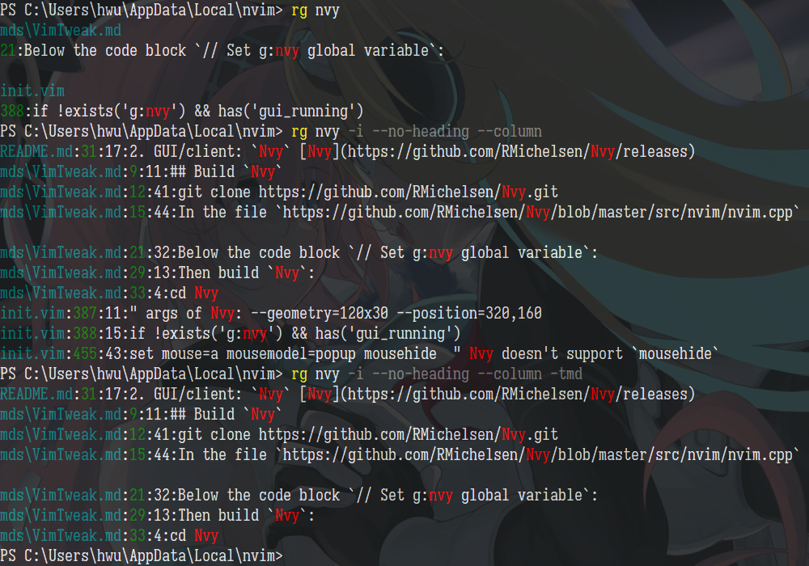
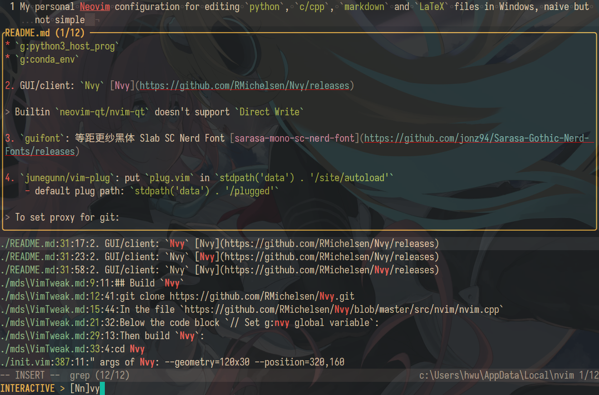

# `neoclide/coc-lists` and `BurntSushi/ripgrep`

## `ripgrep`

### Screenshots





### Options

Search for patterns from the given file:  
- `-f/--file <PATTERNFILE>...`  
    - cf. `rg word -- ./folder`  

Search specific types of files:  
- `rg -tpy foo` limits your search to Python files  
- `rg -Tjs foo` excludes JavaScript files from your search  
> Show all supported file types: `--type-list`  
- `rg clap -g '*.toml'`  
- `rg clap -g '!*.toml'`  
    - cf. `--glob` and `--iglob`  

Specify additional ignore files:  
- `--ignore-file <PATH>...`, `--ignore-file-case-insensitive`  

Search files in text encodings other than UTF-8  
- such as UTF-16, latin-1, GBK, EUC-JP, Shift_JIS and more  
- `-E/--encoding`  

Search files compressed in a common format  
- (brotli, bzip2, gzip, lz4, lzma, xz, or zstandard)  
- `-z/--search-zip`  

Follow symbolic links while recursively searching: `-L/--follow`  

Replace matches with the given text: `-r/--replace <REPLACEMENT_TEXT>`  

Show results in `vim` compatible format: `--vimgrep`  

Support CRLF line terminators (useful on `Windows`): `--crlf`  

Patterns:  
- `-i/--ignore-case`,  `-S/--smart-case`  
- `-F/--fixed-strings`: Treat the pattern as a literal string.  
- `-w/--word-regexp`: Only show matches surrounded by word boundaries. `pattern` -> `\b(?:pattern)\b`  
- `-U/--multiline`: Permit matches to span multiple lines.  
- `-v/--invert-match`: Invert matching.  

Output format and style:  
- `--stats`: Print statistics about this ripgrep search.  
- `-c/--count`: Only show the count of matching lines for each file.  
    - `--count-matches`: Only show the count of individual matches for each file.  
- `-l/--files-with-matches`: Only show the paths with at least one match.  
    - cf. `--files-without-match`  
- `--no-heading`: Don't group matches by each file.  
- `-n/--line-number`, `--column`: Show line/column numbers.  
- `-C/--context <NUM>`: Show NUM lines before and after each match.  
    - `--context-separator <SEPARATOR>`: Set the context separator string.  

### Build

1. Install [`Rust`](https://www.rust-lang.org/learn/get-started)  

2. Build  
``` dotbatch
git clone --depth 1 https://github.com/BurntSushi/ripgrep
cd ripgrep
cargo build --release
./target/release/rg --version
```

Results:  
```
ripgrep 13.0.0 (rev f4d07b9cbd)
-SIMD -AVX (compiled)
+SIMD +AVX (runtime)
```

Finally, add `*\target\release\rg` to the PATH Environment Variable.  

## `coc-lists`

- `files`: search files by `rg`  
- `grep`: grep text by `rg`  
- `lines`: match lines of current buffer by regexp  
    - Patterns are separated by space, pattern starts with '!' means nagitive  
- `mru`: most recent used files  
    - Use command `mru.validate` to remove files that not exists any more  

> **Tip**: type <kbd>?</kbd> on normal mode to get help of current list  

### In `coc-settings.json`

``` jsonc
{
  // coc-lists
  "session.saveOnVimLeave": false,
  "list.source.files.defaultOptions": [ "--no-quit" ],
  "list.source.files.defaultArgs": [ "-folder" ],
  "list.source.grep.defaultOptions": [ "--auto-preview", "--no-quit", "--interactive" ],
  "list.source.grep.defaultArgs": [ "-folder", "-regex" ],
  "list.source.grep.args": [],
  "list.source.lines.defaultOptions": [ "--auto-preview", "--no-quit", "--interactive" ],
  "list.source.mru.defaultOptions": [ "--auto-preview", "--no-quit" ],
  "list.source.mru.defaultArgs": [ "-A" ],
}
```

### In `init.vim`

``` vim
" coc-lists
nmap <silent> \e <Cmd>CocList diagnostics<CR>
nmap <silent> \s <Cmd>CocList symbols<CR>
nmap <silent> \f <Cmd>CocList files<CR>
nmap <silent> \g <Cmd>CocList grep<CR>
nmap <silent> \l <Cmd>CocList lines<CR>
nmap <silent> \r <Cmd>CocList mru<CR>
```
