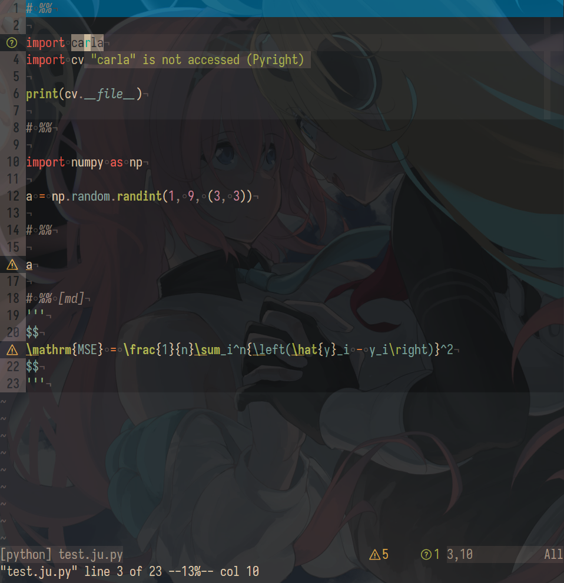
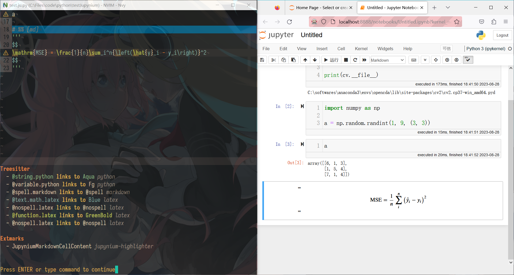
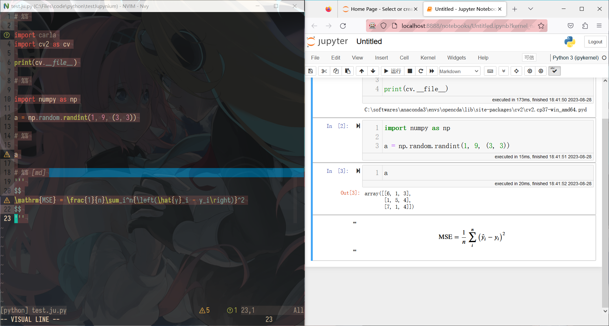
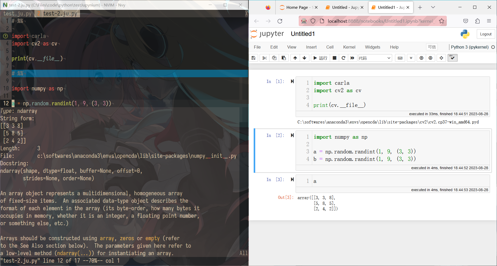

# `kiyoon/jupynium.nvim`

## Screenshots

Inspect variable value


Linting using `pyright` and dim inactive cells


Highlight and preview of `markdown` cell


Select cells via vim visual mode


Interact with multiple jupynium files


## Requirements

1. `Neovim` >= v0.8  
2. Firefox browser (and Mozilla `geckodriver`)  
    > Other browsers are not supported due to their limitation with Selenium  
    > see [this issue](https://github.com/kiyoon/jupynium.nvim/issues/49#issuecomment-1443304753)  

3. `Python` >= 3.7  
    - `pip` >= 23.0 is recommended  
    - `pip3 install --upgrade pip`  
4. `Jupyter Notebook` >= 6.2  

**Make sure that the following commands won't throw errors**  

```
jupyter notebook
```
or  
```
conda run --no-capture-output -n some_env jupyter notebook
```

## In `init.vim`

``` vim
let g:conda_env = 'opencda'

" Plug 'kiyoon/jupynium.nvim', { 'do': 'pip3 install --user .' }
Plug 'kiyoon/jupynium.nvim', { 'do': 'conda run --no-capture-output -n '
    \. g:conda_env . ' pip install .' }

" usage:
" 1. open a `*.ju.py` file
" 2. `:JupyniumStartAndAttachToServer` to open Jupyter Notebook in Firefox
" 3. `:JupyniumStartSync [filename]` to create an `Untitled.ipynb` file
" 4. type `# %%` in nvim to create a code cell
" note: do not make changes inside the browser, as the sync is only one-way

" jupynium file format (*.ju.py or *.ju.*) follows Jupytext's percent format
" code cell separator: `# %%`
" magic commands: `# %time`
" markdown cell: `# %% [md]` or `# %% [markdown]`
"    in python, wrap the whole cell content as a multi-line string:
"    # %% [md]
"    """
"    # This is a markdown heading
"    This is markdown content
"    """

function s:goto_the_one_cell_sep_above()
    if match(getline('.'), '^# %%') == 0
        lua require'jupynium.textobj'.goto_previous_cell_separator()
    else
        lua require'jupynium.textobj'.goto_current_cell_separator()
    endif
endfunction
function s:set_keymap_for_jupynium()
    " text-object key mappings
    map <buffer> [j <Cmd>call <SID>goto_the_one_cell_sep_above()<CR>
    map <buffer> ]j <Cmd>lua require'jupynium.textobj'.goto_next_cell_separator()<CR>
    xmap <buffer> ij <Cmd>lua require'jupynium.textobj'.select_cell(false, false)<CR>
    omap <buffer> ij <Cmd>lua require'jupynium.textobj'.select_cell(false, false)<CR>
    xmap <buffer> aj <Cmd>lua require'jupynium.textobj'.select_cell(true, false)<CR>
    omap <buffer> aj <Cmd>lua require'jupynium.textobj'.select_cell(true, false)<CR>
    " command key mappings
    " nmap <buffer> <F5> <Cmd>lua fn_wo_ext = vim.fn.expand '%:r:r' vim.cmd([[JupyniumStartSync ]] .. fn_wo_ext)<CR>
    nmap <buffer> <F5> <Cmd>JupyniumStartSync<CR>
    map <buffer> <S-CR> <Cmd>JupyniumExecuteSelectedCells<CR><Cmd>lua require'jupynium.textobj'.goto_next_cell_separator()<CR>
    map <buffer> <leader>c <Cmd>JupyniumClearSelectedCellsOutputs<CR>
    nmap <buffer> <leader>v <Cmd>JupyniumKernelHover<CR>
endfunction
augroup JupyniumKeyMap
    autocmd!
    autocmd BufWinEnter *.ju.* call s:set_keymap_for_jupynium()
augroup END

" highlight for jupynium
hi! link JupyniumCodeCellSeparator MatchParen
hi! link JupyniumMarkdownCellSeparator MatchParen
hi! link JupyniumMagicCommand Keyword
```

Set by `lua`:  
``` lua
require("jupynium").setup({
    python_host = vim.g.python3_host_prog,
    -- python_host = { "conda", "run", "--no-capture-output", "-n",
    --                 vim.g.conda_env, "python" },
    jupyter_command = "jupyter",
    -- jupyter_command = { "conda", "run", "--no-capture-output", "-n",
    --                     vim.g.conda_env, "jupyter" },
    jupynium_file_pattern = { "*.ju.*" },
    auto_start_server = { enable = true, file_pattern = { "*.ju.*" }, },
    auto_attach_to_server = { enable = true, file_pattern = { "*.ju.*" }, },
    auto_start_sync = { enable = false, file_pattern = { "*.ju.*" }, },
    auto_download_ipynb = true,

    use_default_keybindings = false,
    textobjects = { use_default_keybindings = false, },
    syntax_highlight = { enable = true, },
    -- dim all cells except the current one
    shortsighted = true,
})
```

## Caution

``` vim
Plug 'kiyoon/jupynium.nvim', { 'do': 'conda run --no-capture-output -n '
    \. g:conda_env . ' pip install .' }
```

This may fail. You should install python package `jupynium` locally and manually then.  
